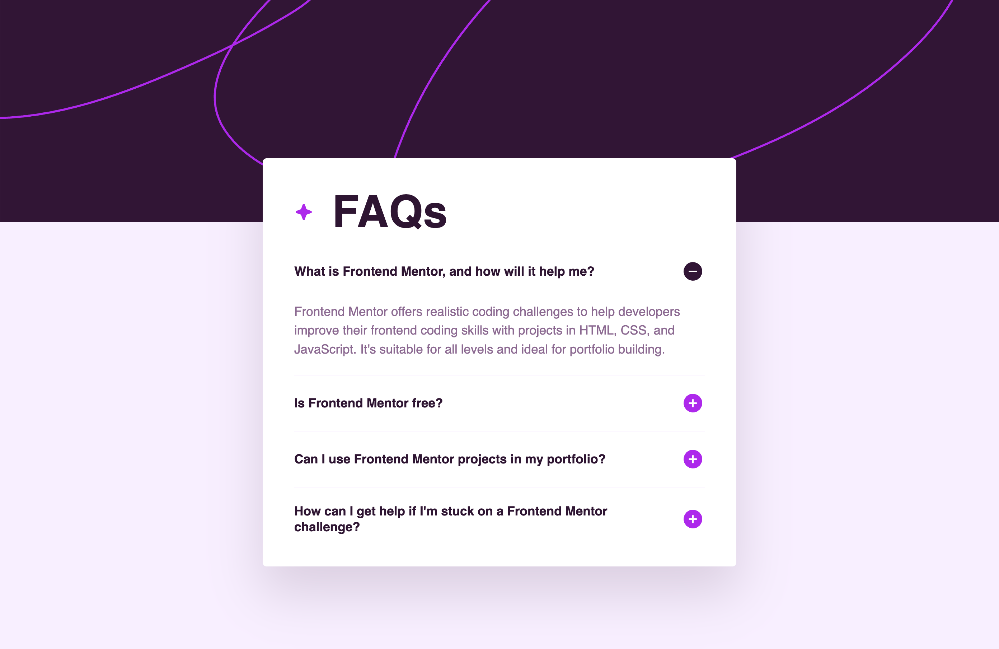

# Frontend Mentor - FAQ accordion solution

This is my solution to the [FAQ accordion challenge on Frontend Mentor](https://www.frontendmentor.io/challenges/faq-accordion-wyfFdeBwBz).

The project is a responsive FAQ accordion built with semantic HTML, CSS, and vanilla JavaScript. The main goal was to practice static layout, accessible interactive components, and DOM-based state switching.

## Table of contents

- [Overview](#overview)
  - [The challenge](#the-challenge)
  - [Screenshot](#screenshot)
  - [Links](#links)
- [My process](#my-process)
  - [Built with](#built-with)
  - [What I learned](#what-i-learned)
  - [Continued development](#continued-development)
  - [Useful resources](#useful-resources)
- [Author](#author)

## Overview

### The challenge

Users should be able to:

- Hide and show the answer to a question when the question is clicked
- Navigate the questions and hide/show answers using keyboard navigation alone
- View the optimal layout for the interface depending on their device's screen size
- See hover and focus states for all interactive elements on the page

### Screenshot



### Links

- Solution URL: [GitHub repository](https://github.com/MathCat0000/faq-accordion)
- Live Site URL: [Live site](https://mathcat0000.github.io/faq-accordition/)

## My process

### Built with

- Semantic HTML5 markup
- CSS custom properties
- CSS reset with `box-sizing: border-box`
- Flexbox
- Mobile-first workflow
- Responsive background images
- Vanilla JavaScript
- ARIA attributes for accordion state
- Accessible button-based interaction

### What I learned

This project helped me understand how a small interactive component is structured as a system:

```text
FAQ accordion =
semantic HTML
+ static CSS layout
+ button-controlled interaction
+ visible/hidden answer state
+ ARIA state synchronization
````

One important structural decision was placing the question text inside a real button:

```html
<h2 class="faq-question">
  <button
    type="button"
    class="faq-button"
    aria-expanded="false"
    aria-controls="faq-answer-1"
  >
    <span>What is Frontend Mentor, and how will it help me?</span>
    
  </button>
</h2>
```

This made the question both clickable and keyboard-accessible by default.

I also learned how to connect each button to its answer using `aria-controls` and matching `id` values:

```html
<button aria-controls="faq-answer-1">
  ...
</button>

<p class="faq-answer" id="faq-answer-1">
  ...
</p>
```

The JavaScript logic is based on a simple state switch:

```js
const isExpanded = button.getAttribute("aria-expanded") === "true";
const newExpanded = !isExpanded;

button.setAttribute("aria-expanded", String(newExpanded));
answer.hidden = !newExpanded;
```

This keeps the visual state and accessibility state aligned.

I also practiced replacing SVG placeholders with image assets and switching the icon dynamically:

```js
icon.src = newExpanded
  ? "./assets/images/icon-minus.svg"
  : "./assets/images/icon-plus.svg";
```

### Continued development

Areas I want to keep improving:

* Building static CSS layouts more systematically
* Controlling spacing without relying on trial and error
* Understanding when to use `gap`, `padding`, and `margin`
* Writing responsive layouts from mobile to desktop
* Improving accessibility patterns for interactive components
* Adding smooth open/close animations without breaking accessibility
* Structuring JavaScript state logic more clearly

### Useful resources

* [MDN Web Docs - button element](https://developer.mozilla.org/en-US/docs/Web/HTML/Element/button) - Helped clarify why the question should be inside a real button.
* [MDN Web Docs - aria-expanded](https://developer.mozilla.org/en-US/docs/Web/Accessibility/ARIA/Reference/Attributes/aria-expanded) - Useful for understanding how to expose accordion state to assistive technology.
* [MDN Web Docs - hidden attribute](https://developer.mozilla.org/en-US/docs/Web/HTML/Global_attributes/hidden) - Helped with the first simple show/hide implementation.
* [CSS-Tricks - A Complete Guide to Flexbox](https://css-tricks.com/snippets/css/a-guide-to-flexbox/) - Useful reference for aligning the question text and icon inside the button.

## Author

* Frontend Mentor - [@MathCat0000](https://www.frontendmentor.io/profile/MathCat0000)

